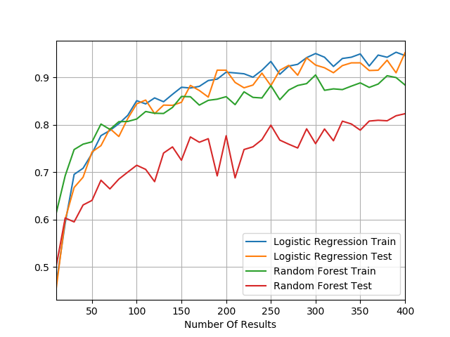
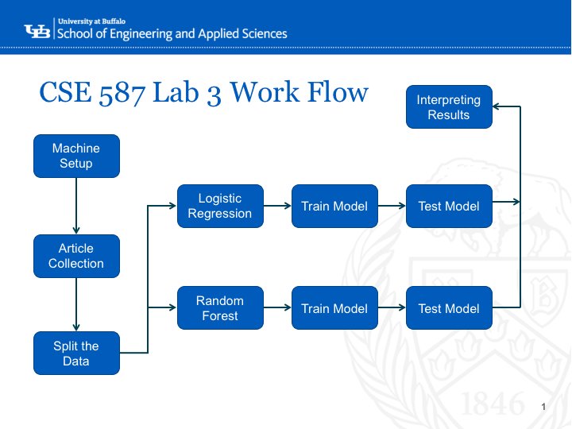

# CSE 587 Lab 3 Spring 2018
Contributors:
* Jon Hunt* Joe Hadley

## Machine Setup
To do this project we set up Scala and Spark on our local machines(Ubuntu/MACOS). We then used sbt to compile and package our Scala files and a bash script to send the packaged Scala jar to the spark-submit application. In order to run our package you will have to unzip the data folder, set your SPARK_HOME to your spark installation and run the run.sh script in the Lab3 directory.
## Data Collection
#### Article Types
For this project we were required to gather articles for Business, Politics, and Sports as well as another article type of our choosing. The other type of article that we chose to collect was Science.
#### Article Collection
The New York Times API was used with Python to gather URL's to 500 articles for each article type mentioned above. Once we had all of the article links, we made a scraper in Python using the beautiful soup package to go to each article URL, extract the body of the article, and save the article to a file.
#### Splitting the Data
The articles were stored in separate folders corresponding to their type. Using python the articles were then randomly split and stored into training, testing, and validation data sets and were again segregated based on article type. The splitting was done such that for each article type, 300 of the articles were assigned to the training data set, 100 were assigned to the validation data set and the remaining articles were assigned to the test data set.
## Analysis
For cleaning the data and building/testing models, Scala and Spark were used.
#### Classification Overview
To classify the document types we used logistic regression and random forests. These classifiers were trained on the training documents and the number of features to use was selected by checking the accuracy of the validation data on the trained models. Once the number of features to use was chosen, the test documents were used to obtain an unbiased accuracy of the tuned model.
#### Training the models
To train the models, term frequency - inverse document frequency (tf-idf) was used to weight the terms in the training articles and to select the top 300 features for each document type. The selected features were then used to build the classifier models.
#### Logistic Regression
There is not much to tune for a Logistic regression model unless you start changing optimization parameters. This made it so we did not do any cross validation on the logistic regression model since the model would come out roughly the same each time.
#### Random Forest
For the random forest model we did not set any parameters to limit the growth or pruning of the trees but did use cross validation to test accuracy since very different models can result from random forests.
#### Results
The plot below shows the validation and training accuracy for the Random Forest and Logistic Regression models. By looking at this figure, it can be seen that there is not much improvement to the validation accuracy in either model
after 300 features. Therefore we chose to set the number of features to 300 in order to keep the models as simple as possible.

Once we knew that we wanted to have 300 features, we trained the model with the training data and then used the testing data to get an unbiased test accuracy since none of the models have seen the testing data yet. The results for the models with 300 features can be seen in the following table.

Model               | Training Accuracy | Testing Accuracy
--------------------|-------------------|-----------------
Logistic Regression |        95.1       |      90.8
Random Forest       |        89.3       |      78.3

## Project Work Flow

